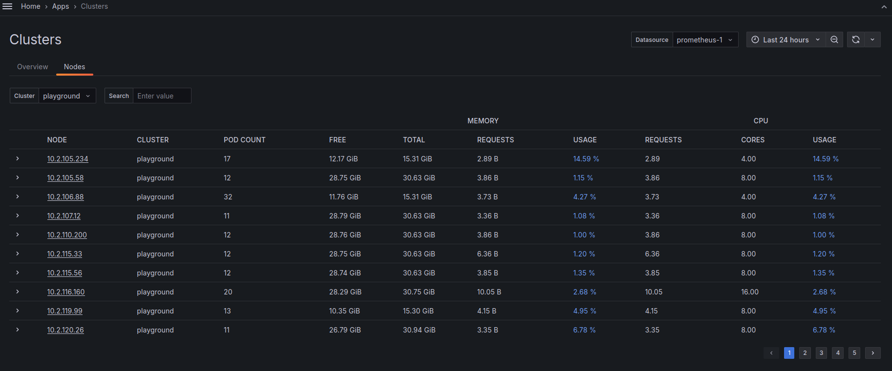
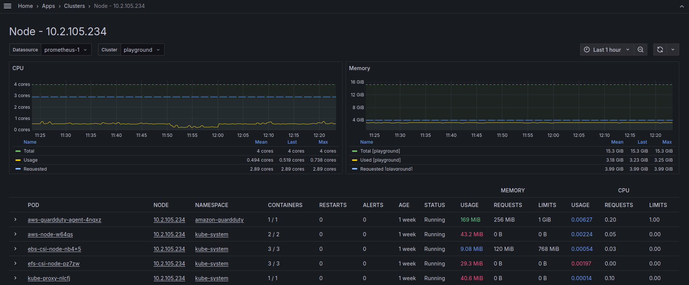
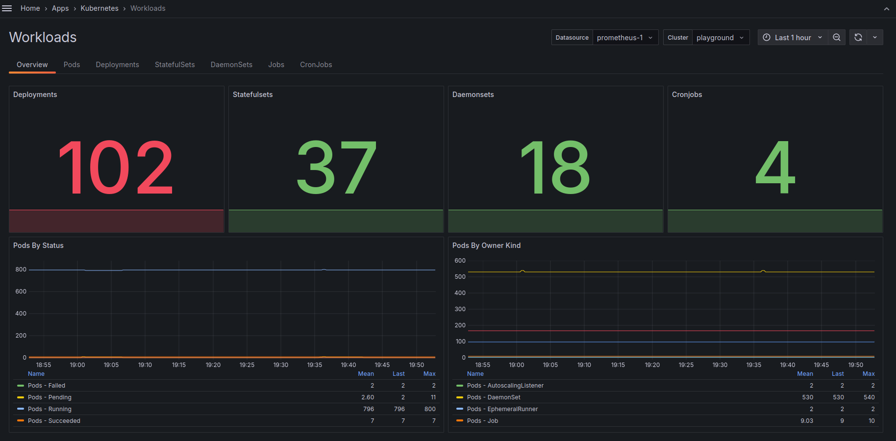
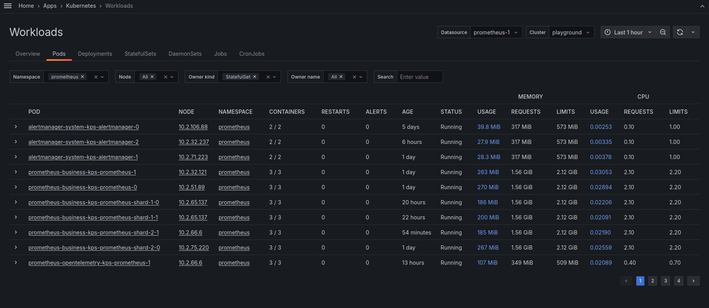
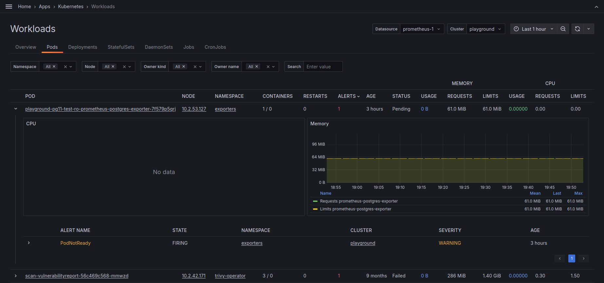
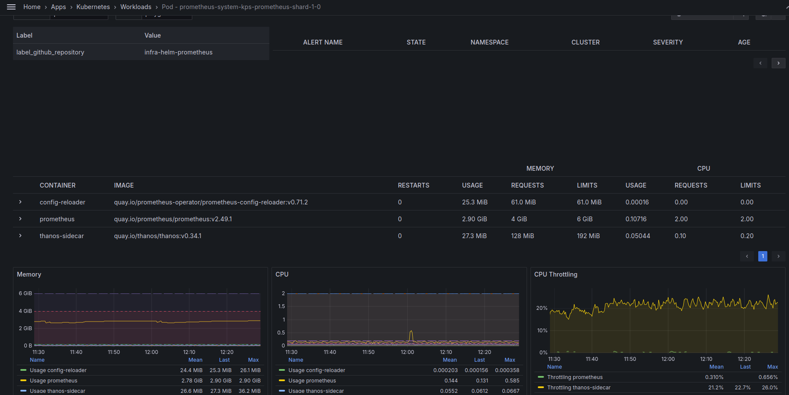
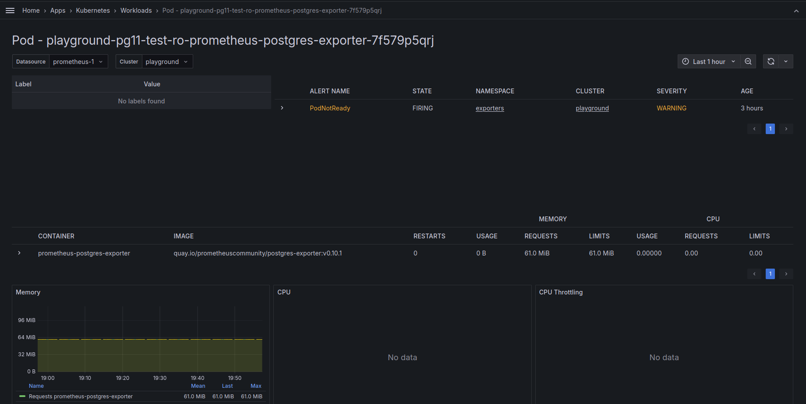
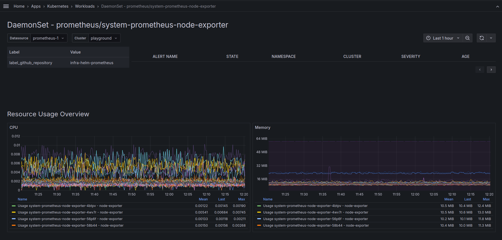
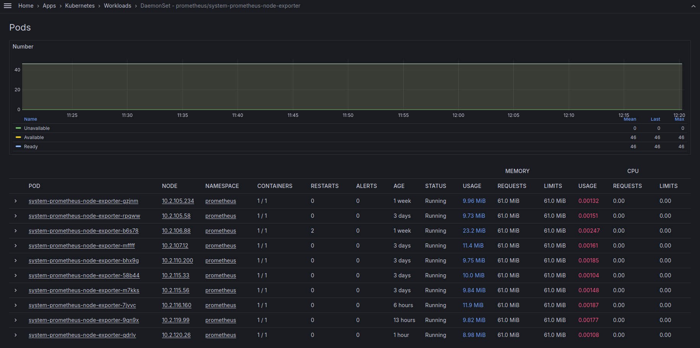

# Grafana Scenes Kubernetes Application

> [!WARNING]  
> This application is in very early alpha stage.

## Overview
 test
Grafana Scenes Kubernetes Application is a Grafana plugin that provides a way to visualize Kubernetes resources in Grafana.

This plugin relies on presence of default kube-state-metrics and node-exporter metrics.

### Requirements

* It expects the presence of `spoke` label on all the metrics.
  
### Metrics used

Metrics and required labels used by application can be found in [metrics.ts](src/metrics/metrics.ts).

### Screenshots

#### Spoke


#### Workloads


#### Pod Details


#### Daemonset


## Installation

### Grafana deployed with Helm

Add packaged docker image as init container to Grafana deployment.

#### With zip file

```yaml
grafana:
  plugins:
    - https://github.com/tiithansen/grafana-k8s-app/releases/download/v<version>grafana-k8s-app-v<version>.zip;grafana-k8s-app
  grafana.ini:
    plugins:
      # Allow this plugin to be loaded even if it's unsigned
      allow_loading_unsigned_plugins: k8s-app
    navigation.app_sections:
      # Move the plugin from More Apps to Infrastructure in the menu
      k8s-app: infrastructure
```

#### With init container

```yaml
# Init container
extraInitContainers:
  - name: grafana-scenes-k8s-app
    image: ghcr.io/tiithansen/grafana-k8s-app:latest # or any other version
    command:
      - sh
      - '-c'
      - |
        mkdir -p /var/lib/grafana/plugins/grafana-k8s-app
        cp -rv /package/* /var/lib/grafana/plugins/grafana-k8s-app
    imagePullPolicy: IfNotPresent
    volumeMounts:
      - name: storage
        mountPath: /var/lib/grafana
grafana.ini:
  plugins:
    # Allow this plugin to be loaded even if it's unsigned
    allow_loading_unsigned_plugins: k8s-app
  navigation.app_sections:
    # Move the plugin from More Apps to Infrastructure in the menu
    k8s-app: infrastructure
```

### Configuration

Application can be configured from the plugin settings page in Grafana.
Settings page can be found at: `/plugins/k8s-app?page=configuration`.

#### Metrics settings

* Metrics datasource - Allows configuring regex to filter metrics from the prometheus datasources. (default=prometheus)
* Default datasource - Allows configuring default datasource for the metrics.
* Default spoke - Allows configuring default spoke to be used in the queries.
* Spoke filter - Allows customizing the query which is used to get label values for the spoke variable.

#### Logs & Events settings (EXPERIMENTAL)

Allows displaying logs and events from Loki.

* Feature exepects events to be exported by [opentelemetry-collector-contrib k8seventsreceiver](https://github.com/open-telemetry/opentelemetry-collector-contrib/blob/main/receiver/k8seventsreceiver/README.md).
* Logs must be exported to Loki by `opentelemetry-collector` because it relies on stream labels in format of `k8s_...`.
* Datasource used must support multi-tenant queries where stream label `k8s_cluster_name` is used to select logs from specific tenant.
* It is possible to override the default queries per view (Spoke, Node, Pod, Deployment, Statefulset, Daemonset).

##### Sample configuration for events collection with k8seventsreceiver

[Opentelemetry-collector helm chart](https://github.com/open-telemetry/opentelemetry-helm-charts/tree/main/charts/opentelemetry-collector) is used as a parent chart for the following configuration.

```yaml
global:
  clusterName: "dummy-spoke"
  lokiEndpoint: "https://loki.example/otlp"

opentelemetry-collector:

  mode: deployment

  image:
    repository: "otel/opentelemetry-collector-contrib"

  serviceAccount:
    create: true

  clusterRole:
    create: true
    rules:
    # Allow the collector to read all resources in the spoke
    - apiGroups:
      - "*"
      resources:
      - "*"
      verbs: ["get", "watch", "list"]

  ports:
    metrics:
      enabled: true
    otlp:
      enabled: false
    otlp-http:
      enabled: false
    jaeger-compact:
      enabled: false
    jaeger-thrift:
      enabled: false
    jaeger-grpc:
      enabled: false
    zipkin:
      enabled: false

  resources:
    requests:
      memory: 128Mi
      cpu: 300m
    limits:
      memory: 512Mi
      cpu: 1000m

  config:
    receivers:
      k8s_events:
        auth_type: "serviceAccount"
    exporters:
      otlphttp/loki:
        endpoint: "{{ .Values.global.lokiEndpoint }}"
        headers:
          "X-Scope-OrgID": "{{ .Values.global.clusterName }}"
    processors:
      resource:
        attributes:
          - key: k8s.spoke.name
            value: "{{ .Values.global.clusterName }}"
            action: insert
          - key: service.name
            value: "k8sevents"
            action: insert
      transform:
        error_mode: ignore
        log_statements:
          - context: log
            statements:
              # Move the namespace name to the resource attributes and remove it from the log attributes
              # This way Loki can use the namespace name as a stream label
              - set(resource.attributes["k8s.namespace.name"], attributes["k8s.namespace.name"]) where attributes["k8s.namespace.name"] != nil
              - delete_key(attributes, "k8s.namespace.name") where attributes["k8s.namespace.name"] != nil

    service:
      extensions:
      - health_check
      pipelines:
        logs:
          exporters:
          - otlphttp/loki
          processors:
          - memory_limiter
          - resource
          - transform
          - batch
          receivers:
          - k8s_events
        metrics: null
        traces: null
```

#### Ruler settings (EXPERIMENTAL)

Allows displaying additional information about the alerts which is not available in `ALERTS` and `ALERTS_FOR_STATE` metrics via labels.

* Currently rulers which support Prometheus HTTP REST API (Thanos, Mimir, Prometheus).
* This feature displays `annotations` and `query` for each alert.

#### Analytics settings (EXPERIMENTAL)

Allows exporting of user views/visits of the application to Grafana analytics service.

## Contributing

### Local Development

1. Clone the repository.
2. Run `npm install` to install the dependencies.
3. Run `npm run dev` to start development server.
4. Run `docker compose up` to start Grafana with the plugin.
5. Navigate to `http://localhost:3000/plugins/k8s-app` and configure the plugins datasource.
6. Open Grafana at `http://localhost:3000/a/k8s-app/workloads`.
