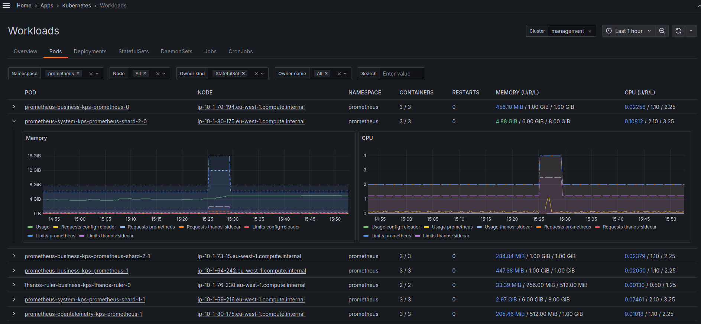
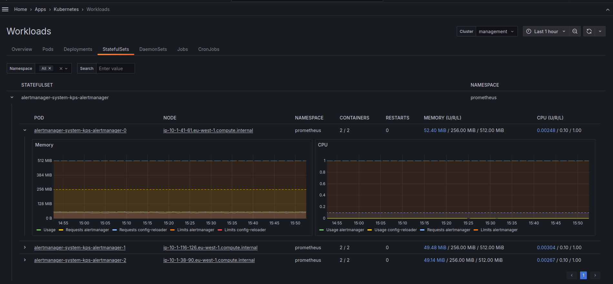
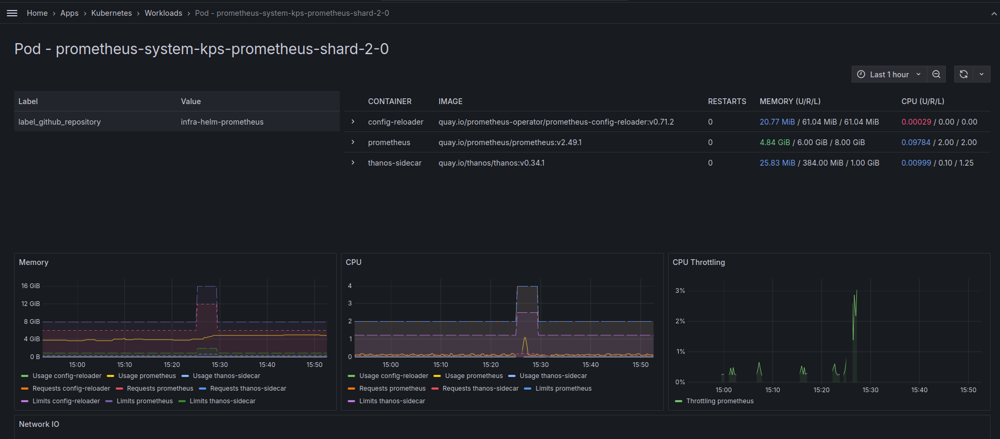

# Grafana Scenes Kubernetes Application

> [!WARNING]  
> This application is in very early alpha stage.

## Overview

Grafana Scenes Kubernetes Application is a Grafana plugin that provides a way to visualize Kubernetes resources in Grafana.

This plugin relies on presence of default kube-state-metrics and node-exporter metrics.

### Current limitations

* It expects the presence of `cluster` label on all the metrics.

### Metrics used

* `kube_pod_info` expected labels `namespace`, `pod`, `node`, `created_by_kind`, `created_by_name`  - Used to get the pod information

### Screenshots

#### Workloads



#### Pod Details


## Planned Features & Improvements

Following list is not in any particular order.

* Create page to view Node details.
* Create page to view Deployment, StatefulSet, DaemonSet, CronJob and Job details.
* Create page for Cluster overview.
* Implement sorting by columns.
  * Initial sorting for Pods is implemented. 
* Display alerts on the resources.
* Integrate OpenCost metrics to visualize cost of the resources.
* Feature to show stopped resources.
  Because a lot of the queries are `instant` then the stopped resources are not shown even if time range is set to show them.

If you have any feature requests, improvements or suggestions, please create an issue.

## Installation

### Grafana deployed with Helm

Add packaged docker image as init container to Grafana deployment.

```yaml
# Init container
extraInitContainers:
  - name: grafana-scenes-k8s-app
    image: ghcr.io/tiithansen/grafana-k8s-app:latest # or any other version
    command: ["cp", "-r", "/package", "/var/lib/grafana/plugins/grafana-k8s-app"]
    imagePullPolicy: IfNotPresent
    volumeMounts:
      - name: external-grafana-plugins
        mountPath: /var/lib/grafana/plugins/grafana-k8s-app
# Mount for the server
extraVolumeMounts:
  - name: external-grafana-plugins
    mountPath: /var/lib/grafana/plugins/grafana-k8s-app
# Volume for the server
extraVolumes:
  - name: external-grafana-plugins
    emptyDir: {}
```
## Contributing

### Local Development

1. Clone the repository.
2. Run `npm install` to install the dependencies.
3. Run `npm run dev` to start development server.
4. Run `docker-compose up` to start Grafana with the plugin.
5. Navigate to `http://localhost:3000/plugins/k8s-app` and configure the plugins datasource.
6. Open Grafana at `http://localhost:3000/a/k8s-app/workloads`.
