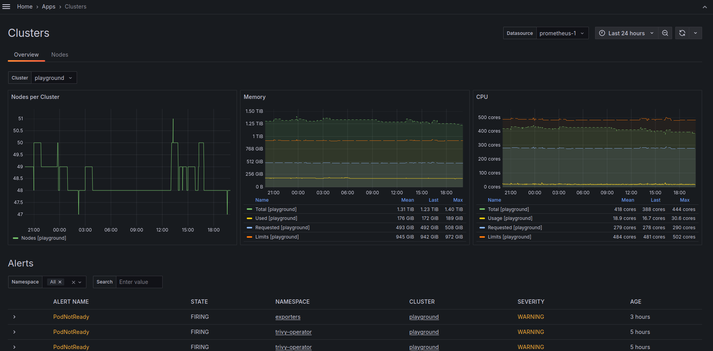

# Grafana Scenes Kubernetes Application

> [!WARNING]  
> This application is in very early alpha stage.

## Overview

Grafana Scenes Kubernetes Application is a Grafana plugin that provides a way to visualize Kubernetes resources in Grafana.

This plugin relies on presence of default kube-state-metrics and node-exporter metrics.

### Current limitations

* It expects the presence of `cluster` label on all the metrics.

### Metrics used

Metrics and required labels used by application can be found in [metrics.ts](src/metrics/metrics.ts).

### Screenshots

#### Cluster


#### Workloads


#### Pod Details


#### Daemonset


## Planned Features & Improvements

Following list is not in any particular order.

* Create page to view Node details.
  * Basic node details page is implemented.
* Create page to view Deployment, StatefulSet, DaemonSet, CronJob and Job details.
  * Basic detailed pages for different resources is implemented.
* Create page for Cluster overview.
  * Basic cluster overview page is implemented.
* Implement sorting by columns.
  * Initial sorting for Pods is implemented. 
* Display alerts on the resources.
  * Alerts are displayed for Pods, DaemonSets and StatefulSets
    For alerts to be displayed alert needs to have `cluster` and kind label `pod|daemonset|statefulset` with name as the value.
* Integrate OpenCost metrics to visualize cost of the resources.
* Feature to show stopped resources.
  Because a lot of the queries are `instant` then the stopped resources are not shown even if time range is set to show them.
  * Partially implemented for pods, its possible to toggle to view which are not running anymore. It lookup pods using `present_over_time` with timerange
    specified in the UI time picker.
* Add support for Karpenter metrics.
  Optional displaying of Karpenter metrics.
  Which could be toggled from the plugin settings.
* Add support for resource relations.
  Depends on Kube-State-Metrics to expose relations between resources [Related feature request](https://github.com/kubernetes/kube-state-metrics/issues/2424).
* Add support to see Kubernetes event logs
  Display events which have been exported by [kubernetes-event-exporter](https://github.com/resmoio/kubernetes-event-exporter) into Loki.
* Display networking resources and metrics
  * Display Ingress metrics
    * Display Nginx Ingress Controller metrics (need to figure out how to make the connection between `kube_ingress_info` and if its nginx controlled)


If you have any feature requests, improvements or suggestions, please create an issue.

## Installation

### Grafana deployed with Helm

Add packaged docker image as init container to Grafana deployment.

```yaml
# Init container
extraInitContainers:
  - name: grafana-scenes-k8s-app
    image: ghcr.io/tiithansen/grafana-k8s-app:latest # or any other version
    command:
      - sh
      - '-c'
      - |
        mkdir -p /var/lib/grafana/plugins/grafana-k8s-app
        cp -rv /package/* /var/lib/grafana/plugins/grafana-k8s-app
    imagePullPolicy: IfNotPresent
    volumeMounts:
      - name: storage
        mountPath: /var/lib/grafana
grafana.ini:
  plugins:
    # Allow this plugin to be loaded even if it's unsigned
    allow_loading_unsigned_plugins: k8s-app
  navigation.app_sections:
    # Move the plugin from More Apps to Infrastructure in the menu
    k8s-app: infrastructure
```
## Contributing

### Local Development

1. Clone the repository.
2. Run `npm install` to install the dependencies.
3. Run `npm run dev` to start development server.
4. Run `docker compose up` to start Grafana with the plugin.
5. Navigate to `http://localhost:3000/plugins/k8s-app` and configure the plugins datasource.
6. Open Grafana at `http://localhost:3000/a/k8s-app/workloads`.
